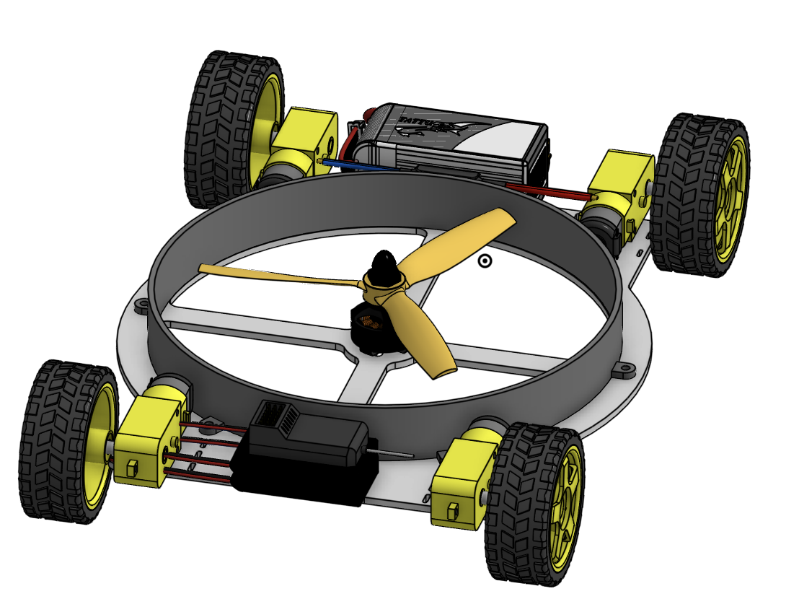
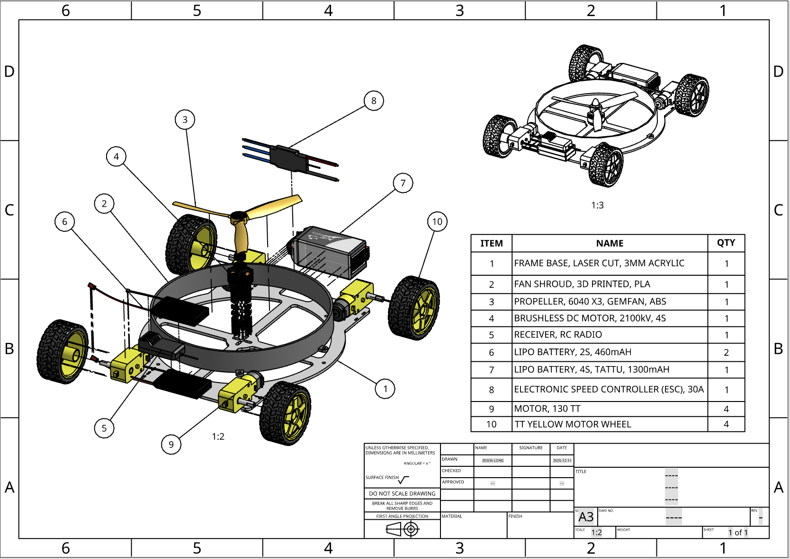
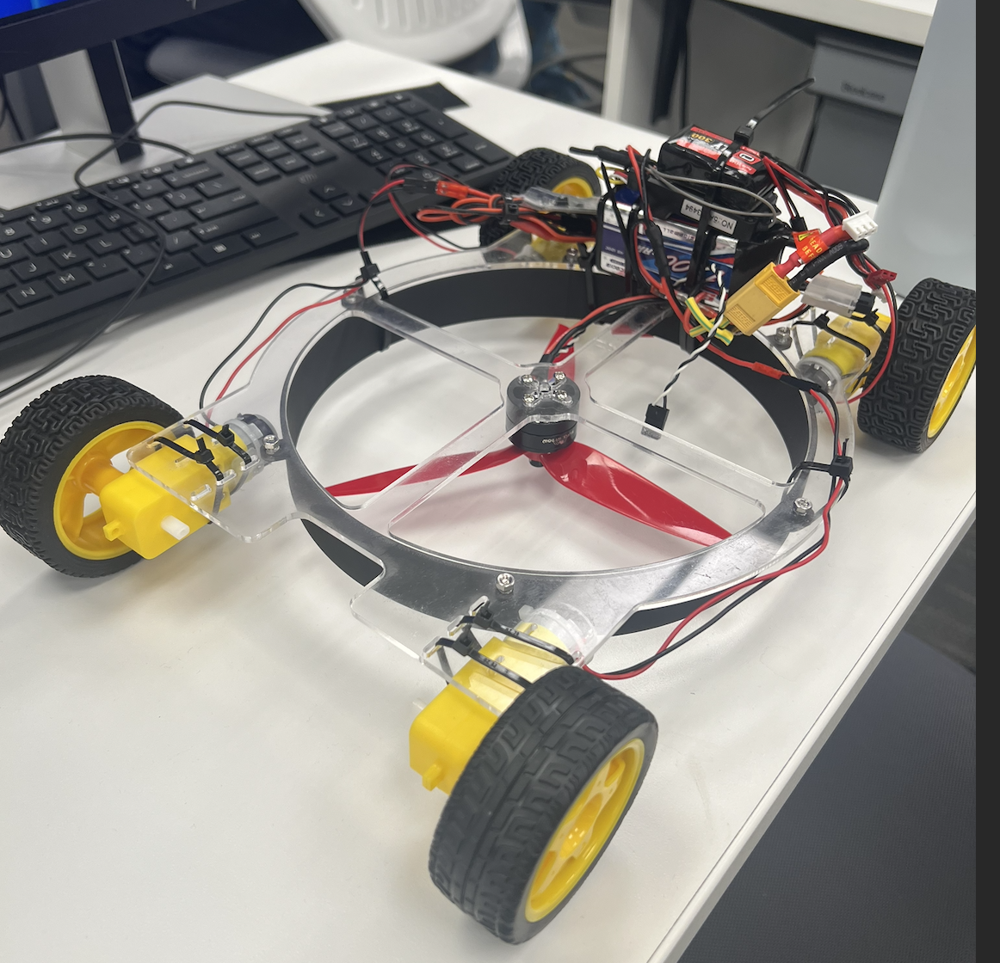
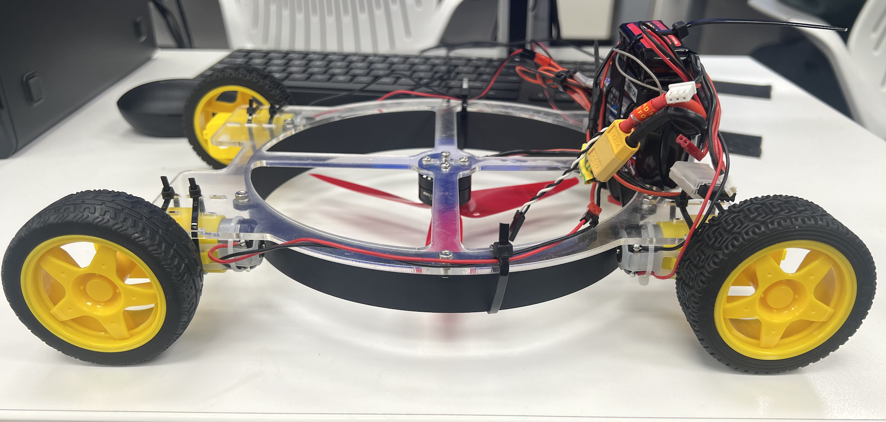
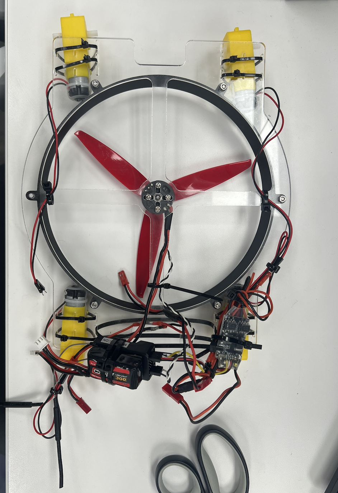

<div align="center">

# Fan-Adhesion Wall-Climbing Vehicle

### An ENGR 7 final project by Zesen Long

[Project Report (PDF)](docs/ENGR7-Final-Project-Report.pdf) · [Presentation Source](docs/ENGR7-Final-Project-Report.pptx) · [Test Video](https://www.youtube.com/watch?v=rkJMb2a5TWg)


</div>



## Overview

This project explores a compact, remotely controlled vehicle that can drive on horizontal surfaces and climb a vertical wall. A centrally mounted fan and shroud create a pressure differential beneath the chassis. The resulting adhesion force increases the wheel normal force so tire friction can counteract gravity.

The prototype was developed through CAD modeling, friction and thrust analysis, laser cutting, 3D printing, assembly, and iterative testing. It was completed as an ENGR 7 final project in Fall 2025.

## Course context

**ENGR 7 — Introduction to Engineering Methods** is a 4-unit Irvine Valley College course. IVC's official catalog describes it as a practical course for engineering and applied-science students centered on modeling and designing a physical system. The course develops experience in structural analysis, small-component manufacturing, testing, teamwork, planning, scheduling, project management, and implementation of a final design. Projects may also involve data collection, design reviews, analysis, technical reports, and group construction.

This wall-climbing vehicle is the student's final-project response to that hands-on engineering-methods context; it is not an official IVC publication. Course information is summarized from the official [IVC 2022–2023 catalog](https://www.ivc.edu/sites/default/files/catalog/archive/ivc-2022-23-catalog.pdf) and the current [IVC Drafting Technology and Engineering program map](https://www.ivc.edu/idea/drafting).

## Project results

| Metric | Result |
| --- | --- |
| Final assembled mass | 630 g |
| Hardware represented in the BOM | $110.20 |
| Newly purchased parts | Within the $100 course budget because several electronic components were reused |
| Conservative measured static-friction coefficient | Approximately 0.60 for rubber wheels on the wood test surface |
| Analytical adhesion checkpoint | Approximately 5.8 N for the 0.357 kg analysis case used in the report |
| Functional test | Successful horizontal driving and vertical wall-climbing demonstration |

The thrust figures in the report come from a closely matched motor–propeller configuration, not the exact final hardware. Full-vehicle testing was therefore used as the final functional validation.

## How it works

The fan accelerates air away from the cavity formed by the chassis, shroud, and wall. Lower pressure beneath the vehicle produces an adhesion force toward the wall. That force raises the available tire friction:

```text
available traction = coefficient of friction × effective normal force
```

For vertical climbing, available traction must exceed the vehicle weight. The project combines that force balance with a four-wheel drivetrain, independent fan power, and radio control.

## Design and fabrication

- Laser-cut 3 mm acrylic chassis
- 3D-printed PLA fan shroud
- Four TT gear motors with rubber wheels
- 2204-class brushless motor and 6040-series propeller
- Separate 2S drive battery and 4S fan battery
- RC receiver, brushed motor controllers, and brushless ESC
- M3 fasteners and revised zip-tie motor retention



## CAD resources

The editable models are hosted in Onshape. Access may require an Onshape account and depends on the document-sharing settings.

- [Revised chassis design](https://cad.onshape.com/documents/8f2b1385e5c2777b0d7f55ff/w/a33525b9fe7c85fa3e08191d/e/e2afc8d6ee1a74b23a157cfd)
- [Revised fan shroud](https://cad.onshape.com/documents/bbc107611efbcd623c7f3fc4/w/9fecfa40b241bb5c82b9e00a/e/d9c63ff9de1bd5586ec66d00)
- [Final CAD assembly](https://cad.onshape.com/documents/bc01b1242a0c7c2e8e971602/w/7b4b4b57db1f0e65245290fb/e/62365271f940056add8ab758)
- [Assembly drawing](https://cad.onshape.com/documents/bc01b1242a0c7c2e8e971602/w/7b4b4b57db1f0e65245290fb/e/3e9e85bdd05b72353cc5ce74)

The repository currently contains drawings, renders, photos, and the project report. Native CAD exports were not present in the archived project folder and are therefore not represented as downloadable STEP/STL/DXF files here.

## Bill of materials

The machine-readable [BOM](bom.csv) and formatted [BOM workbook](bom.xlsx) list the final component set, quantities, specifications, and recorded costs. Prices reflect the project period and should not be treated as current supplier quotes.

## Gallery

| Perspective | Side view |
| --- | --- |
|  |  |



## Known limitations and next steps

- Increase fan-shroud height from 25 mm to the 38 mm design target.
- Move motor mounts away from the chassis edge to eliminate tire interference.
- Replace zip ties with purpose-built motor brackets for repeatable alignment.
- Add a dedicated battery compartment and cleaner cable routing.
- Repeat thrust characterization with the exact final motor, propeller, shroud, and battery.
- Export native CAD files into open interchange formats for easier reproduction.

## Safety

This is an educational prototype, not a certified product. It uses high-speed rotating propellers and lithium-polymer batteries. Review [SAFETY.md](SAFETY.md) before attempting to reproduce or operate any part of the design.

## Academic-material boundary

This repository contains the student's own report, design work, data presentation, photographs, and build documentation. Course handouts, assignment sheets, grading materials, exams, and instructor-provided source files are intentionally excluded. Figures labeled “Instructor Baseline” in the report are retained only to document the student's design-evolution context and are excluded from the repository's hardware-license grant.

## Acknowledgements

This project benefited from the instruction, technical guidance, facilities, and collaborative learning environment provided during ENGR 7:

- **Professor Matthew Wolken** — course guidance, design feedback, technical instruction, material recommendations, project direction, and clear expectations.
- **Professor Brett McKim** — instruction in design-model making and insights into fabrication and prototyping methods.
- **Marlowe Patterson**, Laboratory Technician at the Irvine Valley College School of Integrated Design, Engineering, and Automation (IDEA) — assistance with 3D printing, laser cutting, lab equipment, and a safe prototyping environment.
- **IVC IDEA Department** — access to fabrication facilities, tools, materials, and workspace used for rapid prototyping and testing.
- **ENGR 7 classmates** — a learning environment that encouraged hands-on experimentation, iteration, and practical engineering problem-solving.

These acknowledgements are transcribed and condensed from the project's original presentation. Recognition does not imply institutional or individual endorsement of this repository.

## Licensing

- Original hardware design material by Zesen Long is released under **CERN-OHL-S-2.0**.
- Original report text, photographs, and documentation by Zesen Long are released under **CC BY 4.0**.
- Third-party products, logos, referenced test data, and instructor-provided baseline material remain the property of their respective owners and are not relicensed.

See [LICENSE.md](LICENSE.md) and [NOTICE.md](NOTICE.md) for the exact scope.

## Citation

If this project helps your work, please cite it using [CITATION.cff](CITATION.cff).
